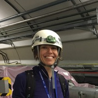
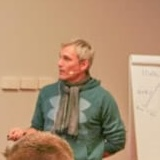

  

    
    
Auralee Edelen

    
SLAC

  

  

    
    
Annika Eichler

    
DESY

  

  

    
    
Andrea Santamaria Garcia

    
University of Liverpool

  

    
  

    
    
Georg Hoffstaetter

    
Cornell

   

  
  

    
    
Verena Kain

    
CERN

  

  
  

    
    
Hirokazu Maesaka

    
Spring-8

   

      
  

    
    
Daniel Ratner

    
TJNAF

  

    
  

    
    
Jean-Luc Vay

    
LBNL

  

<h3>IOC Alumni</h3>

  

    
    
Paul Chu

    
NJU

  

  

    
    
Kevin Brown

    
BNL

  

  

    
    
Ilya Agapov

    
DESY

  

  

    
    
Tia Miceli

    
FNAL

  

  

    
    
Andreas Adelmann

    
PSI

  

  

    
    
Kevin Li

    
CERN

  

  

    
    
Nobuhisa Fukunishi

    
RIKEN

  

