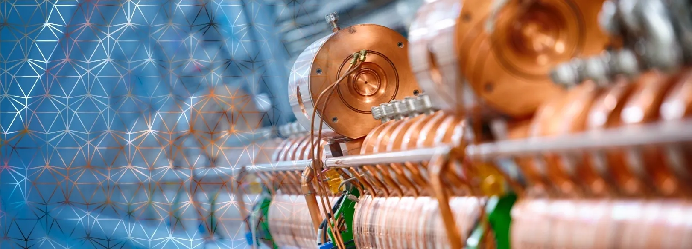

# Home

Welcome to the homepage of the _Machine Learning for Particle Accelerators (MaLAPA)_ collaboration.

## Our mission

Our mission is to connect researchers in the field and advance the deployment of machine learning-based systems to particle accelerator facilities to ultimately enable the next generation of accelerators and novel scientific applications.
