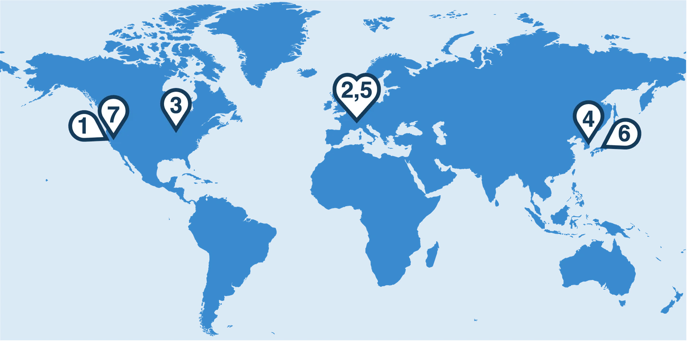

# Workshops

!!! tip "Upcoming: 7th MaLAPA Workshop"

    **[LBNL @ Berkeley, USA](https://conferences.lbl.gov/event/2574/)** · April 26–29, 2027

    [Workshop website and registration](https://conferences.lbl.gov/event/2574/){ .md-button .md-button--primary }

## Past workshops

| # | Year | Host | Location | Dates |
|---|------|------|----------|-------|
| 6 | 2026 | [SPring-8](https://indico.rcnp.osaka-u.ac.jp/event/2676/) | Himeji, Japan | April 21–24 |
| 5 | 2025 | [CERN](https://indico.cern.ch/event/1382428/) | Geneva, Switzerland | April 8–11 |
| 4 | 2024 | [PAL](https://www.indico.kr/event/47/) | Gyeongju, Korea | March 5–8 |
| 3 | 2022 | [BNL](https://www.bnl.gov/mlaworkshop2022/) | Chicago, USA | November 1–4 |
| 2 | 2019 | [PSI](https://indico.psi.ch/event/6698/) | Villigen, Switzerland | February 26 – March 1 |
| 1 | 2018 | [SLAC](https://indico.fnal.gov/event/16327/) | Palo Alto, USA | February 27 – March 2 |

